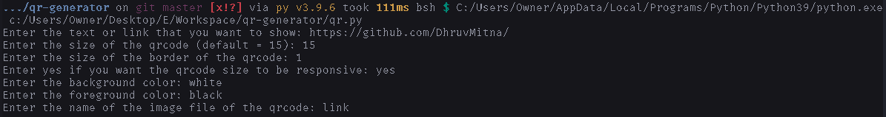
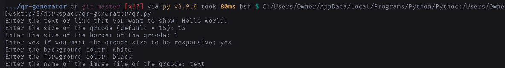

# How to use

1. Install [python](https://python.org/downloads).
2. Download [`qr.py`](https://raw.githubusercontent.com/DhruvMitna/qr-generator/master/qr.py) and the folder [`output`](https://github.com/DhruvMitna/qr-generator/blob/master/ouput/) (by pressing `ctrl` + `s`).
3. Press `win + r`.
4. Type `'cmd'` and press enter.
5. Type `'cd Downloads'` and press enter.
6. Type `'qr.py'` and press enter.
7. Enter all the details of the qrcode when prompted.
8. A qrcode will be placed in the output folder.

## Examples

